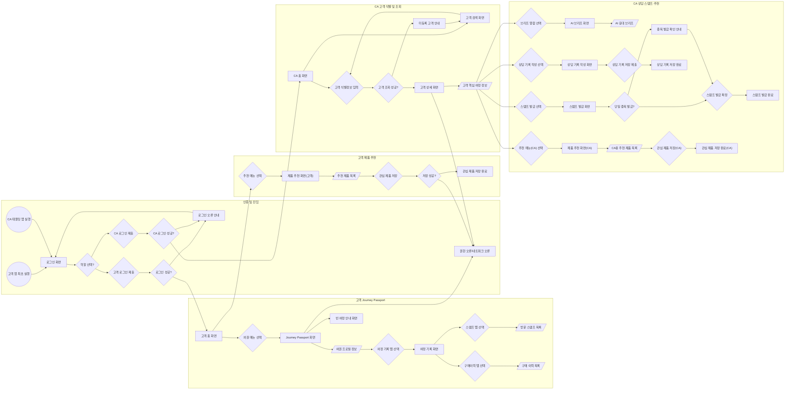

```mermaid
flowchart LR

  subgraph s1 ["인증 및 진입"]
    n1(("고객 앱 최초 실행"))
    n2(("CA 태블릿 앱 실행"))
    n3["로그인 화면"]
    n4{"역할 선택?"}
    n5{"고객 로그인 제출"}
    n6{"CA 로그인 제출"}
    n7{"로그인 성공?"}
    n8{"CA 로그인 성공?"}
    n9["로그인 오류 안내"]
    n81["권한 오류/네트워크 오류"]
  end

  subgraph s2 ["고객 Journey Passport"]
    n10["고객 홈 화면"]
    n11["Journey Passport 화면"]
    n12[/"여권 프로필 정보"/]
    n13{"여정 기록 탭 선택"}
    n14["여정 기록 화면"]
    n15[/"방문 스탬프 목록"/]
    n16[/"구매 이력 목록"/]
    n17{"스탬프 탭 선택"}
    n18{"구매이력 탭 선택"}
    n19{"여권 메뉴 선택"}
    n80["빈 여정 안내 화면"]
  end

  subgraph s3 ["고객 제품 추천"]
    n20["제품 추천 화면(고객)"]
    n21[/"추천 제품 목록"/]
    n22{"관심 제품 저장"}
    n23{"저장 성공?"}
    n24["관심 제품 저장 완료"]
    n25{"추천 메뉴 선택"}
  end

  subgraph s4 ["CA 고객 식별 및 조회"]
    n30["CA 홈 화면"]
    n31["고객 검색 화면"]
    n32{"고객 식별정보 입력"}
    n33{"고객 조회 성공?"}
    n34["미등록 고객 안내"]
    n35["고객 상세 화면"]
    n36[/"고객 핵심 여정 정보"/]
  end

  subgraph s5 ["CA 상담·스탬프·추천"]
    n40["AI 브리프 화면"]
    n41[/"AI 응대 브리프"/]
    n42{"브리프 열람 선택"}
    n50["스탬프 발급 화면"]
    n51{"스탬프 발급 선택"}
    n52{"당일 중복 발급?"}
    n53["중복 발급 확인 안내"]
    n54{"스탬프 발급 확정"}
    n55["스탬프 발급 완료"]
    n60["상담 기록 작성 화면"]
    n61{"상담 기록 작성 선택"}
    n62{"상담 기록 저장 제출"}
    n63["상담 기록 저장 완료"]
    n70["제품 추천 화면(CA)"]
    n71[/"CA용 추천 제품 목록"/]
    n72{"추천 메뉴(CA) 선택"}
    n73{"관심 제품 저장(CA)"}
    n74["관심 제품 저장 완료(CA)"]
  end

  n1 --> n3
  n2 --> n3
  n3 --> n4
  n4 --> n5
  n4 --> n6
  n5 --> n7
  n6 --> n8
  n7 --> n10
  n7 --> n9
  n8 --> n30
  n8 --> n9
  n9 --> n3
  n10 --> n19
  n19 --> n11
  n11 --> n12
  n12 --> n13
  n13 --> n14
  n14 --> n17
  n14 --> n18
  n17 --> n15
  n18 --> n16
  n11 --> n80
  n10 --> n25
  n25 --> n20
  n20 --> n21
  n21 --> n22
  n22 --> n23
  n23 --> n24
  n23 --> n81
  n30 --> n32
  n30 --> n31
  n31 --> n32
  n32 --> n33
  n33 --> n35
  n33 --> n34
  n34 --> n31
  n35 --> n36
  n36 --> n42
  n42 --> n40
  n40 --> n41
  n36 --> n51
  n51 --> n50
  n50 --> n52
  n52 --> n53
  n52 --> n54
  n53 --> n54
  n54 --> n55
  n36 --> n61
  n61 --> n60
  n60 --> n62
  n62 --> n63
  n36 --> n72
  n72 --> n70
  n70 --> n71
  n71 --> n73
  n73 --> n74
  n11 --> n81
  n35 --> n81
```
